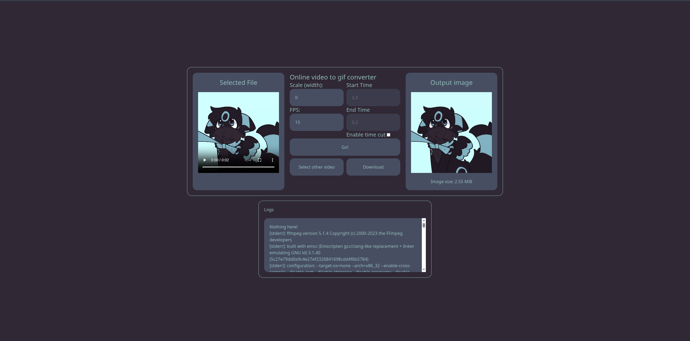

<div align="center">

  <h1>Voidy Converter</h1>

  <p>A simple serverless video-to-GIF converter</p>
  <p>Written in Svelte, Tailwindcss, and ffmpeg</p>
</div>



# Developing

> [!IMPORTANT]
> FFMPEG does not work unless the application is built.

```bash
npm install

# run
npm run dev

# to test convert just build app

npm run build

npm run preview
```
